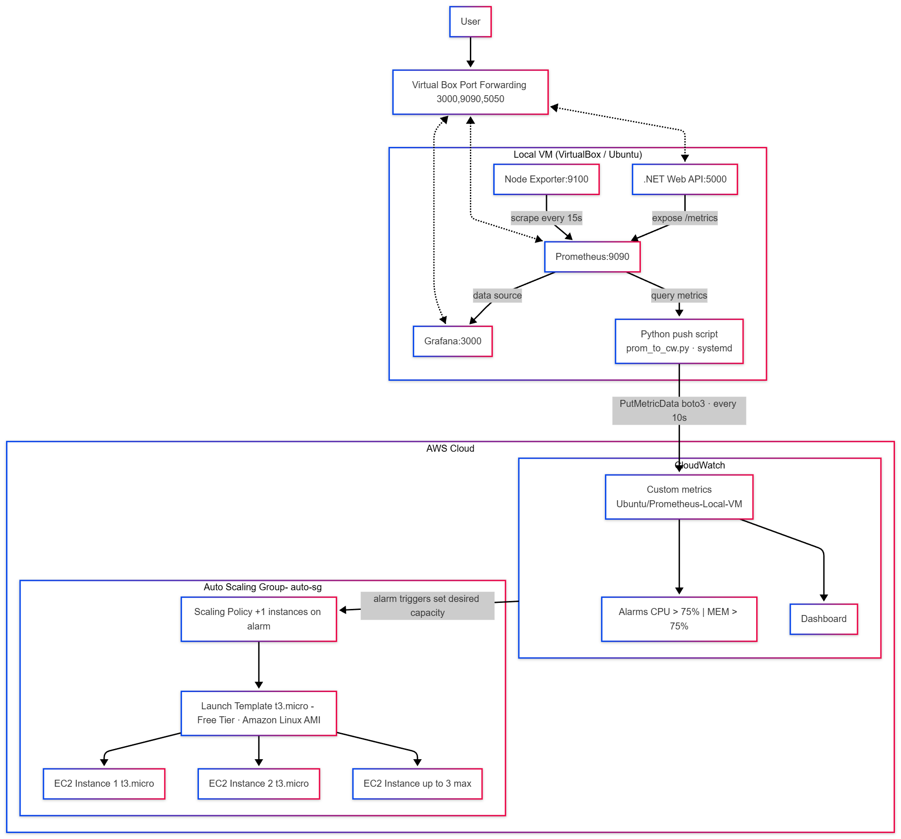

# VCC Assignment 3: Create a Local VM and Auto-Scale It to Any Public Cloud Platform When Resource Usage Exceeds 75% in Local VM
**Student Name:** Ashutosh Nigam  
**Roll Number:** M25AI2006  
**Course:** Virtual Cloud Computing (VCC)  
**Cloud:** Amazon Web Services (AWS)

---

## Problem Statement

Create a local VM and implement a mechanism to monitor resource usage. Configure it to auto-scale to a public cloud (e.g., GCP, AWS, or Azure) when resource usage exceeds 75%.

### Objectives

1. Set up a local virtual machine environment
2. Implement real-time resource monitoring for CPU and Memory
3. Configure auto-scaling policies that trigger cloud deployment when local resources exceed 75% utilization
4. Demonstrate the complete workflow from local deployment to cloud migration
5. Provide comprehensive documentation and demonstration of the system

---

## Project Overview

This ASP.NET Core Web API application serves as a **System Resource Monitor and Load Generator** designed to test and demonstrate hybrid cloud auto-scaling capabilities. The application provides endpoints to:

- Monitor system resources (CPU, Memory)
- Trigger controlled CPU spikes
- Trigger controlled Memory spikes
- Provide real-time system status

This API acts as the core application deployed on a local VM that can be monitored by tools like Prometheus/Grafana, which then trigger auto-scaling to cloud platforms when resource thresholds are exceeded.

---
## Architecture Diagram

---

## Technology Stack

- **Framework:** ASP.NET Core 8.0
- **Language:** C# with .NET 8.0
- **API Documentation:** Swagger/OpenAPI
- **Architecture:** RESTful Web API

---

## Prerequisites

Before running this application, ensure you have:

- [.NET 8.0 SDK](https://dotnet.microsoft.com/download/dotnet/8.0) installed
- Windows, Linux, or macOS operating system
- A code editor (Visual Studio, VS Code, or Rider recommended)
- Postman or similar tool for API testing (optional, Swagger UI included)

---

## How to Run the Application

### Method 1: Using .NET CLI (Recommended)

1. **Clone or navigate to the project directory:**
   ```bash
   cd VCC.Assignment3
   ```

2. **Restore dependencies:**
   ```bash
   dotnet restore
   ```

3. **Build the project:**
   ```bash
   dotnet build
   ```

4. **Run the application:**
   ```bash
   dotnet run
   ```

5. **Access the application:**
   - **Swagger UI:** http://localhost:5000/swagger or https://localhost:5001/swagger
   - **API Base URL:** http://localhost:5000/api or https://localhost:5001/api

### Method 2: Using Visual Studio

1. Open `VCC.Assignment3.sln` in Visual Studio
2. Press `F5` to run with debugging or `Ctrl+F5` to run without debugging
3. Browser will automatically open with Swagger UI

## API Endpoints

### 1. **GET** `/api/system/status`
Check if the API is running.

**Response:**
```json
{
  "status": "API is running"
}
```

---

### 2. **GET** `/api/system/resources`
Get current system resource information.

**Response:**
```json
{
  "systemName": "Microsoft Windows 10...",
  "osArchitecture": "X64",
  "frameworkDescription": ".NET 8.0.0",
  "processorCount": 8,
  "systemUptime": "01.12:34:56",
  "totalMemoryGB": 16.0,
  "usedMemoryGB": 8.5,
  "memoryUsagePercent": 53.12
}
```

---

### 3. **POST** `/api/system/memory-spike?spikeSize=<size>`
Trigger a controlled memory spike for testing auto-scaling.

**Query Parameters:**
- `spikeSize` (optional): Size of memory to allocate
  - `Small_500MB` (default): 500 MB
  - `Medium_1GB`: 1 GB
  - `Large_2GB`: 2 GB
  - `XLarge_3GB`: 3 GB
  - `XXLarge_4GB`: 4 GB

**Example:**
```
POST http://localhost:5000/api/system/memory-spike?spikeSize=Medium_1GB
```

**Response:**
```json
{
  "message": "Memory spike triggered",
  "sizeAllocatedMB": 1024,
  "chunks": 102
}
```

---

### 4. **POST** `/api/system/cpu-spike?duration=<duration>`
Trigger a controlled CPU spike for testing auto-scaling.

**Query Parameters:**
- `duration` (optional): Duration of CPU spike
  - `Short_5Seconds` (default): 5 seconds
  - `Medium_10Seconds`: 10 seconds
  - `Long_15Seconds`: 15 seconds
  - `XLong_30Seconds`: 30 seconds
  - `XXLong_60Seconds`: 60 seconds
  - `XXLong_120Seconds` = 120,
  - `XXLong_240Seconds` = 240

**Example:**
```
POST http://localhost:5000/api/system/cpu-spike?duration=Medium_10Seconds
```

**Response:**
```json
{
  "message": "CPU spike triggered",
  "durationSeconds": 10,
  "actualDurationMs": 10005,
  "cpuUtilizationTarget": "80%",
  "threadsUsed": 6,
  "totalProcessors": 8
}
```

---

## Testing the Application

### Using Swagger UI (Easiest Method)

1. Run the application
2. Navigate to http://localhost:5000/swagger
3. Expand any endpoint and click "Try it out"
4. Modify parameters if needed and click "Execute"
5. View the response below

---

## Project Structure

```
VCC.Assignment3/
│
├── Controllers/
│   └── SystemController.cs        # API endpoints for system monitoring and load generation
│
├── Properties/
│   └── launchSettings.json         # Application launch configuration
│
├── appsettings.json                # Application configuration
├── appsettings.Development.json    # Development environment settings
├── Program.cs                      # Application entry point and configuration
├── VCC.Assignment3.csproj          # Project file
└── README.md                       # This file
```

---

## Contact

**Student:** Ashutosh Nigam  
**Roll Number:** M25AI2006  

---

## Acknowledgments

- ASP.NET Core Documentation
- Prometheus & Grafana Community
- Virtual Cloud Computing Course Materials
- [How to Install and Configure Prometheus and Grafana on Ubuntu
](https://www.linode.com/docs/guides/how-to-install-prometheus-and-grafana-on-ubuntu/)
- [Node Exporter Full](https://grafana.com/grafana/dashboards/1860-node-exporter-full/)
- [Installing Grafana](https://grafana.com/docs/grafana/latest/setup-grafana/installation/)
- [Prometheus vs Grafana](https://www.opsramp.com/guides/prometheus-monitoring/prometheus-vs-grafana/)


---
